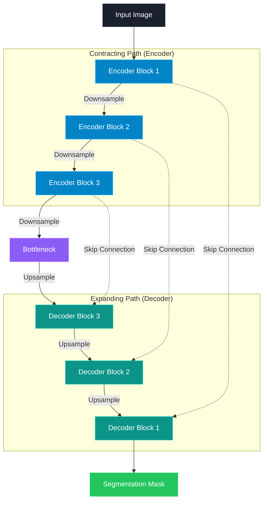

# Deep Image Segmentation with U-Net

<p align="center">
  <b>Semantic Image Segmentation • PyTorch • U-Net • Computer Vision</b>
</p>

<p align="center">
  
  
  
  
  
</p>

## Overview

This project explores **semantic image segmentation** using a U-Net architecture implemented with PyTorch.

The objective is to segment pets from their surrounding background at the pixel level using the **Oxford-IIIT Pet Dataset**.

Rather than focusing only on model training, the project investigates how different training strategies affect segmentation performance through quantitative evaluation and qualitative error analysis.

### Key Focus

* U-Net implementation from scratch
* Pixel-level semantic segmentation
* BCE and Dice-based optimization
* Data augmentation
* Dice and IoU evaluation
* Qualitative prediction analysis
* Error analysis on difficult samples

---

## Dataset

### Oxford-IIIT Pet

The Oxford-IIIT Pet Dataset contains images of cats and dogs together with pixel-level segmentation annotations.

**Dataset configuration**

| Property          | Configuration           |
| ----------------- | ----------------------- |
| Dataset           | Oxford-IIIT Pet         |
| Task              | Semantic Segmentation   |
| Training split    | 80%                     |
| Validation split  | 20%                     |
| Input resolution  | 256 × 256               |
| Number of classes | Foreground / Background |

Images were resized using bilinear interpolation, while segmentation masks were resized using nearest-neighbor interpolation to preserve their discrete labels.

---

## Model Architecture

The segmentation model is a custom **U-Net** implemented in PyTorch.



The network contains:

* Convolutional encoder blocks
* Max-pooling layers
* Bottleneck representation
* Transposed convolutions for upsampling
* Skip connections
* Convolutional segmentation head

Skip connections allow the decoder to recover spatial information lost during downsampling.

---

## Training Strategy

The project investigates the effect of different training configurations.

### Loss Function

The main segmentation objective combines:

``` text
Loss = BCE Loss + Dice Loss
```

**Binary Cross-Entropy** provides pixel-level supervision, while **Dice Loss** encourages better overlap between predicted and ground-truth regions.

### Data Augmentation

The final experiment uses random:

* Horizontal flipping
* Vertical flipping

Augmentation is applied only during training.

---

## Experiments

### Experiment 1 — BCE-only Baseline

A U-Net model was trained using only Binary Cross-Entropy.

| Metric          | Result |
| --------------- | -----: |
| Validation Dice | 0.0383 |
| Validation IoU  | 0.0224 |

The very low overlap scores indicate that BCE-only training was not effective for this segmentation setup.

---

### Experiment 2 — BCE + Dice + Augmentation

The final configuration combines:

```text
U-Net
+
BCE Loss
+
Dice Loss
+
Data Augmentation
```

Results:

| Metric          |     Result |
| --------------- | ---------: |
| Validation Dice | **0.6571** |
| Validation IoU  | **0.5057** |

### Final Comparison

| Configuration             |       Dice |        IoU |
| ------------------------- | ---------: | ---------: |
| BCE-only                  |     0.0383 |     0.0224 |
| BCE + Dice + Augmentation | **0.6571** | **0.5057** |

The final configuration substantially improved segmentation overlap compared with the BCE-only baseline.

---

## Qualitative Results

The model predictions are evaluated visually by comparing:

```text
Original Image → Ground Truth → Prediction
```

Example predictions and difficult cases are provided in the `results/` directory.

### Prediction Examples


### Error Analysis

The model's difficult cases were identified according to their Dice scores.


This analysis helps identify cases where segmentation quality decreases because of challenging object shapes, boundaries, or background conditions.

---

## Evaluation Metrics

### Dice Score

Dice measures the overlap between the predicted segmentation and the ground-truth mask.

Higher values indicate better segmentation overlap.

### Intersection over Union

IoU measures the ratio between the intersection and union of the predicted and ground-truth regions.

Higher values indicate better segmentation quality.

---

## Technologies

| Category            | Tools           |
| ------------------- | --------------- |
| Language            | Python          |
| Deep Learning       | PyTorch         |
| Computer Vision     | Torchvision     |
| Numerical Computing | NumPy           |
| Visualization       | Matplotlib      |
| Model               | U-Net           |
| Dataset             | Oxford-IIIT Pet |

---

## Project Structure

```text
deep-image-segmentation-unet/
│
├── README.md
├── LICENSE
├── requirements.txt
│
├── notebook/
│   └── segmentation.ipynb
│
├── src/
│   ├── dataset.py
│   ├── model.py
│   └── evaluate.py
│
└── results/
    ├── predictions.png
    └── error_analysis.png
```

---

## Reproducibility

Clone the repository and install the required dependencies:

```bash
git clone https://github.com/your-username/deep-image-segmentation-unet.git
cd deep-image-segmentation-unet
pip install -r requirements.txt
```

The complete experimental workflow is available in the Jupyter notebook.

---

## Key Takeaways

This project demonstrates practical experience with:

* Semantic image segmentation
* U-Net architecture design
* Encoder-decoder CNNs
* Skip connections
* Segmentation-specific loss functions
* Data augmentation
* Dice and IoU evaluation
* Quantitative model comparison
* Qualitative error analysis
* PyTorch implementation

---

## Future Work

Possible extensions include:

* Transfer-learning-based segmentation
* Stronger geometric and photometric augmentation
* Weighted BCE + Dice objectives
* Learning-rate scheduling
* Early stopping and model checkpointing
* Comparison with modern segmentation architectures
* Evaluation across different object categories

---

## Author

**Meriem Tafraoui**

AI Engineering Student 
• Computer Vision • Deep Learning • Artificial Intelligence  • machine learning
